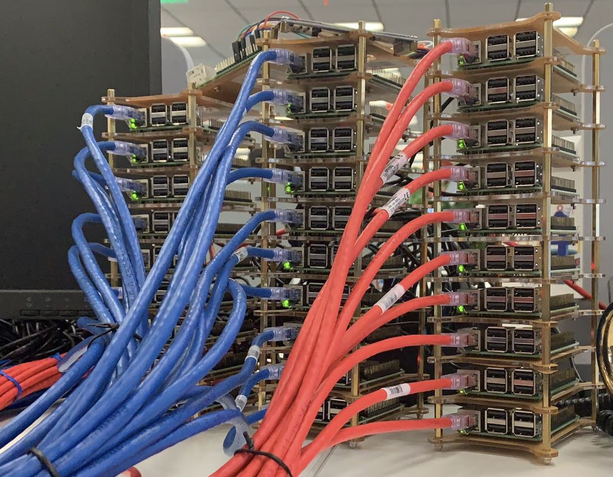
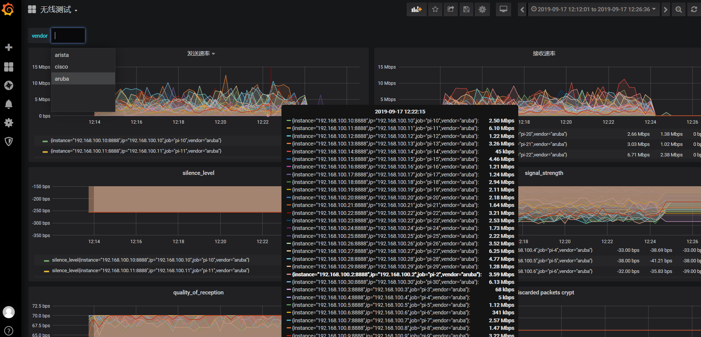
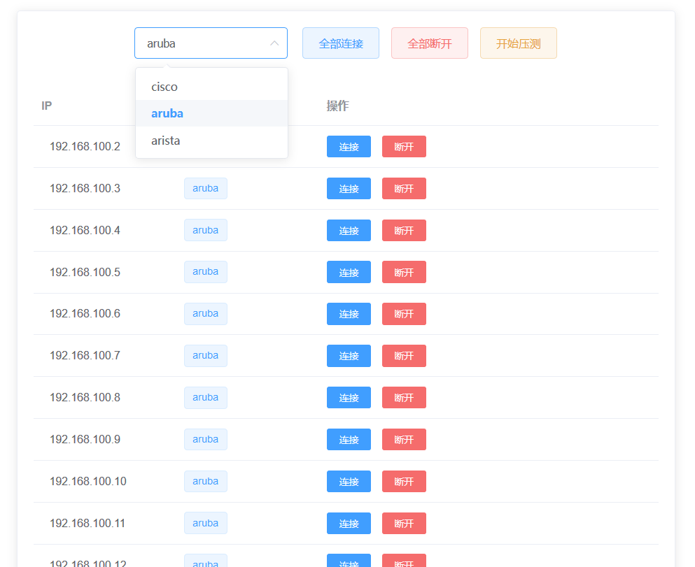

#### 30台树莓派 AP压测项目

- 指标收集展示：Prometheus + Grafana
  
- prometheus exporter：golang1.12
- 管理后台：vue.js
  

#### 【exporter request】

### 厂商：
* 1. cisco
* 2. arista
* 3. aruba

### 切换wifi
http://192.168.100.X:8080/vendor?name=<厂商>

### 查看状态
http://192.168.100.X:8081/state

### 触发压测
http://192.168.100.X:8082/trigger

### promethues exporter
http://192.168.100.X:8888/metrics

